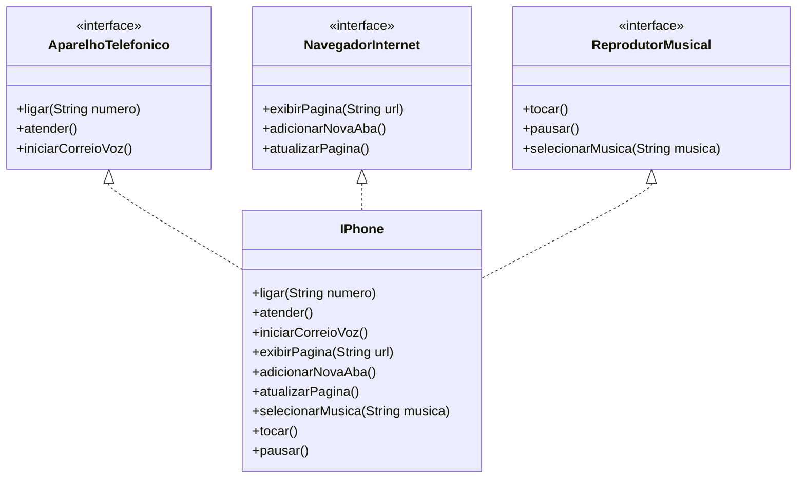

# Modelagem-e-Diagrama-o-de-um-Componente-iPhone

O Repositório contém um projeto escrito em Java da modelagem de componentes de um IPhone

Segue o diagrama de classes UML do mesmo projeto:

```mermaid
classDiagram
    AparelhoTelefonico <|.. IPhone
    NavegadorInternet <|.. IPhone
    ReprodutorMusical <|.. IPhone
    
    class AparelhoTelefonico {
        <<interface>>
        +ligar(String numero)
        +atender()
        +iniciarCorreioVoz()
    }

    class NavegadorInternet {
        <<interface>>
        +exibirPagina(String url)
        +adicionarNovaAba()
        +atualizarPagina()
    }

    class ReprodutorMusical {
        <<interface>>
        +tocar()
        +pausar()
        +selecionarMusica(String musica)
    }

    class IPhone {
        +ligar(String numero)
        +atender()
        +iniciarCorreioVoz()
        +exibirPagina(String url)
        +adicionarNovaAba()
        +atualizarPagina()
        +selecionarMusica(String musica)
        +tocar()
        +pausar()
    }
```
